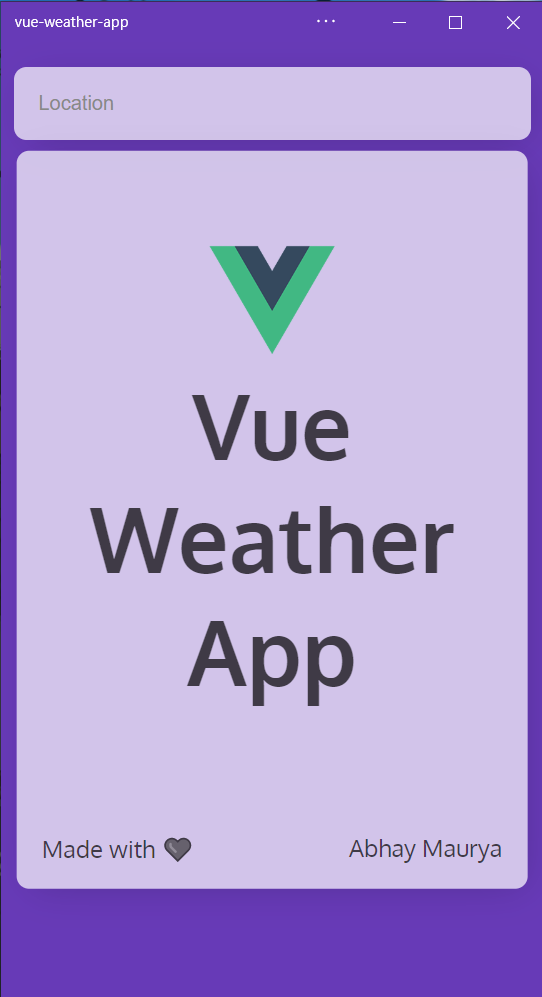

# Vue Weather App (OpenWeatherMap API)
Vue Weather App is a simple PWA which is built using Vue.
Visit https://liquidatorcoder.github.io/vue-weather-app/ to give it a try!

# Demo Screenshots

|  |  |  |
| :-------------: | :-------------:  | :-------------:  |
|     Home     |    Search    |    Clear     | 

|  |  |  |
| :-------------: | :-------------:  | :-------------:  |
|     Haze     |    Rain    |    Cloudy     |

## Project setup
```
npm install
```

### Compiles and hot-reloads for development
```
npm run serve
```

### Compiles and minifies for production
```
npm run build
```

### Lints and fixes files
```
npm run lint
```
